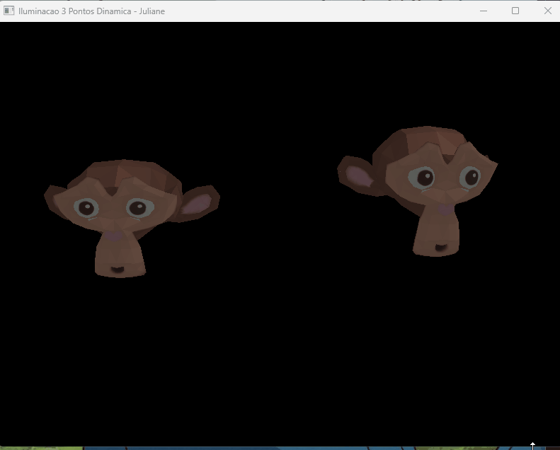

## 1ª Parte - Ambiente

Ambiente configurado com sucesso utilizando Python 3 e OpenGL 2.1 (via PyOpenGL e GLFW).

### Demonstração da Execução do Programa

## 2ª Parte - Cubo e Transformações Geométricas
Implementação da geometria do cubo com cores distintas por face. 

### Controles implementados:
* `W`, `A`, `S`, `D` e `I`, `J`: Translação nos eixos X, Y e Z.
* `X`, `Y`, `Z`: Rotação nos respectivos eixos.
* `[` e `]`: Escala uniforme.
* `TAB`: Alterna a seleção entre os cubos da cena.

### Demonstração da Interação:

## 3ª Parte - Visualizador OBJ e Transformações 3D por Eixo

Implementação do carregamento automatizado do modelo 3D da *Suzanne* (Blender) com controle independente de eixos.

**Controles Implementados:**
* **TAB:** Alterna a seleção entre as duas cabeças da macaca.
* **T (Translação):** Move nos eixos X (A/D), Y (W/S) e Z (Q/E).
* **R (Rotação):** Gira nos eixos X (W/S), Y (A/D) e Z (Q/E).
* **S (Escala):** Escala individual nos eixos X (A/D), Y (W/S) e Z (Q/E).
* **Teclas + e -:** Aplica escala **uniforme** em todos os eixos ao mesmo tempo.

### Demonstração da Interação 

## 4ª Parte - Mapeamento de Texturas (Coordenadas UV)

Nesta etapa, o visualizador foi evoluído para suportar a aplicação de texturas 2D sobre as malhas tridimensionais, realizando a leitura completa dos dados de mapeamento do modelo.

**Implementações Realizadas:**
* **Leitura de Coordenadas UV:** Adaptação do leitor no `objeto.py` para processar as linhas iniciadas com `vt` e associar os índices de textura correspondentes a cada face (`f v/vt/vn`).
* **Integração com arquivo .MTL:** Leitura automatizada do arquivo de material para identificar o arquivo de imagem difusa (`map_Kd`).
* **Carregamento via Pillow (PIL):** Uso da biblioteca Pillow no `main.py` para carregar a imagem do disco, inverter o eixo Y (adequando o padrão de leitura do OpenGL) e enviar os bytes de pixels para a GPU.
* **Configuração de Textura no OpenGL:** Geração de textura com `glGenTextures`, vinculação com `glBindTexture` e definição de filtros lineares de magnificação/minificação para evitar distorções.

### Demonstração das Malhas Texturizadas 

## 5ª Parte - Iluminação de Três Pontos Dinâmica

Nesta última etapa, foi implementado o clássico sistema de iluminação cinematográfica/fotográfica de três pontos, calculado de maneira 100% automatizada com base na posição do objeto selecionado.

**Implementações Realizadas:**
* **Luz Principal (Key Light - GL_LIGHT0):** Fonte de luz mais intensa posicionada à frente e à direita do objeto de foco, definindo o tom e as sombras principais da cena.
* **Luz de Preenchimento (Fill Light - GL_LIGHT1):** Posicionada no lado oposto (à esquerda) com intensidade moderada e tom levemente frio (azulada) para suavizar as sombras geradas pela luz principal.
* **Luz de Fundo (Back Light - GL_LIGHT2):** Posicionada atrás e acima da malha, criando um efeito de silhueta (*rim light*) que separa o objeto tridimensional do fundo escuro da cena.
* **Fator de Atenuação Difusa:** Configuração de atenuação linear nas três fontes de luz (`GL_LINEAR_ATTENUATION`), simulando a perda física de intensidade de luz com base na distância geométrica até a malha.
* **Controle de Teclado Independente:** Mapeamento das teclas numéricas `1`, `2` e `3` para ligar e desligar de forma independente cada uma das três fontes de luz em tempo de execução, permitindo testar o impacto isolado de cada componente.

### Demonstração do Funcionamento

## 6ª Parte - Iluminação Dinâmica (Modelo de Phong)
  
  ## 1. Descrição da Implementação

Nesta etapa, o foco exclusivo foi a integração do **Modelo de Iluminação de Phong** ao pipeline de renderização do projeto. O objetivo principal foi computar tridimensionalmente as três componentes fundamentais da luz (Ambiente, Difusa e Especular) para garantir volume e realismo aos modelos carregados.

Para assegurar estabilidade no meu hardware e contornar limitações de compatibilidade nos drivers legados com estruturas de Shaders modernos (`glUseProgram`), a técnica de Phong foi implementada de forma nativa através da configuração matemática do pipeline fixo do OpenGL, operando diretamente por vértice.

### Componentes do Modelo de Phong Aplicadas:
* **Componente Ambiente ($K_a$):** Garante uma iluminação uniforme básica em todas as faces do objeto, impedindo que as regiões opostas às luzes fiquem completamente pretas.
* **Componente Difusa ($K_d$):** Calcula a intensidade da luz com base no ângulo de incidência dos raios luminosos sobre a superfície, gerando o sombreamento característico das curvaturas da malha.
* **Componente Especular ($K_s$ e $N_s$):** Simula o reflexo brilhante e "espelhado" da fonte de luz. O coeficiente $N_s$ (*shininess*) controla o polimento e a concentração desse ponto de brilho nas curvas.

  ## 2. Estrutura de Arquivos e Processamento de Dados

A implementação dessa parte do projeto exigiu a expansão da leitura de novas propriedades contidas nos arquivos de recursos (*assets*):

1.  **Leitura de Normais (`vn`) no `objeto.py`:** O leitor do arquivo `.obj` foi expandido pra capturar as linhas de vetores normais (`vn`). Durante a renderização, a função `glNormal3fv()` envia a orientação correta de cada vértice antes de mapear sua posição espacial (`glVertex3fv`).
2.  **Leitura de Materiais (`.mtl`):** O método de carga lê os coeficientes específicos configurados no arquivo de materiais (valores de `Ka`, `Kd`, `Ks` e `Ns`). Caso o arquivo esteja ausente, o sistema atribui coeficientes bronzeados por padrão pra evitar telas pretas.
3.  **Configuração de Materiais no OpenGL:** No laço de desenho do objeto, os coeficientes extraídos do material são aplicados nativamente através de chamadas a `glMaterialfv()` e `glMaterialf()`.

   ## 3. Sistema de Iluminação a 3 Pontos (Estúdio)

A cena utiliza uma estrutura de iluminação em estúdio configurada no arquivo `main.py`, onde as fontes reagem em tempo real à posição dos objetos:

* **Luz Principal (Key Light - `GL_LIGHT0`):** Posicionada à frente e à direita do objeto com alta intensidade e cor levemente quente pra criar o volume principal.
* **Luz de Preenchimento (Fill Light - `GL_LIGHT1`):** Posicionada à esquerda com intensidade suave e tom frio pra suavizar as sombras pesadas.
* **Luz de Fundo (Back Light - `GL_LIGHT2`):** Posicionada atrás do modelo pra destacar a silhueta em relação ao fundo escuro da cena.

### Controles Ativos no Teclado:
* `1`, `2` e `3`: Alternam (Ativam/Desativam) a Luz Principal, de Preenchimento e de Fundo, respectivamente.
* `T` / `R` / `S`: Modos de Translação, Rotação e Escala aplicados ao objeto selecionado (alternável via `TAB`).

Demonstração Visual

Abaixo está a gravação demonstrativa que valida a execução correta da iluminação de Phong sobre a geometria das malhas da Suzanne. É possível observar o ponto de luz especular (brilho) deslocando-se de forma suave pelas curvas do modelo conforme ele é rotacionado e transladado no espaço.

---

