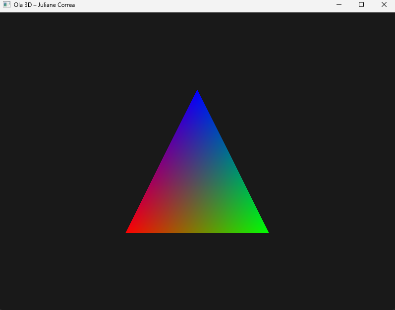
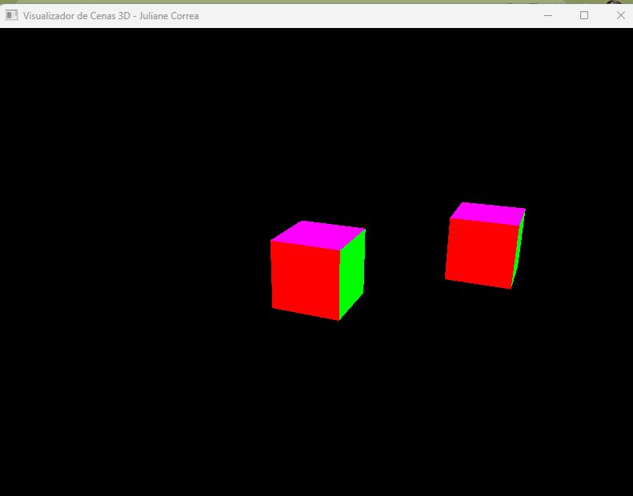
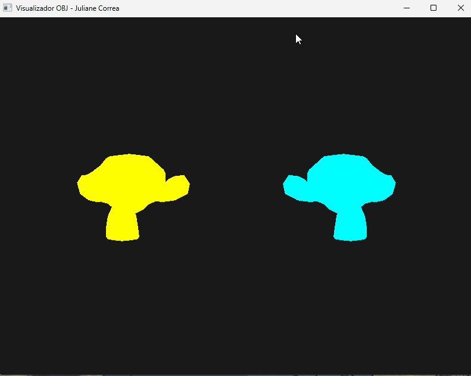
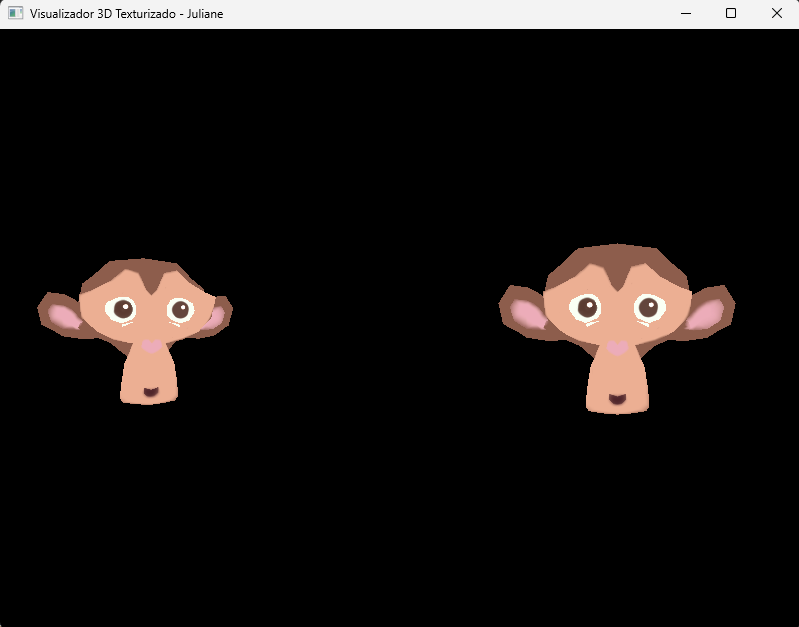

# Resultado da Atividade - Parte 1

Ambiente configurado com sucesso utilizando Python 3 e OpenGL 2.1 (via PyOpenGL e GLFW).

## Print de Execução do Programa

## 2ª Parte - Cubo e Transformações Geométricas
Implementação da geometria do cubo com cores distintas por face. 

### Controles implementados:
* `W`, `A`, `S`, `D` e `I`, `J`: Translação nos eixos X, Y e Z.
* `X`, `Y`, `Z`: Rotação nos respectivos eixos.
* `[` e `]`: Escala uniforme.
* `TAB`: Alterna a seleção entre os cubos da cena.

### Demonstração da Interação:
*(Abaixo está a prova da execução do código com os movimentos ativos)*

## 3ª Parte - Visualizador OBJ e Transformações 3D por Eixo

Implementação do carregamento automatizado do modelo 3D da *Suzanne* (Blender) com controle independente de eixos.

**Controles Implementados:**
* **TAB:** Alterna a seleção entre as duas cabeças da macaca.
* **T (Translação):** Move nos eixos X (A/D), Y (W/S) e Z (Q/E).
* **R (Rotação):** Gira nos eixos X (W/S), Y (A/D) e Z (Q/E).
* **S (Escala):** Escala individual nos eixos X (A/D), Y (W/S) e Z (Q/E).
* **Teclas + e -:** Aplica escala **uniforme** em todos os eixos ao mesmo tempo.

### Demonstração da Interação (Parte 3)
*(Abaixo está o registro do funcionamento com os movimentos ativos)*

## 4ª Parte - Mapeamento de Texturas (Coordenadas UV)

Nesta etapa, o visualizador foi evoluído para suportar a aplicação de texturas 2D sobre as malhas tridimensionais, realizando a leitura completa dos dados de mapeamento do modelo.

**Implementações Realizadas:**
* **Leitura de Coordenadas UV:** Adaptação do leitor no `objeto.py` para processar as linhas iniciadas com `vt` e associar os índices de textura correspondentes a cada face (`f v/vt/vn`).
* **Integração com arquivo .MTL:** Leitura automatizada do arquivo de material para identificar o arquivo de imagem difusa (`map_Kd`).
* **Carregamento via Pillow (PIL):** Uso da biblioteca Pillow no `main.py` para carregar a imagem do disco, inverter o eixo Y (adequando o padrão de leitura do OpenGL) e enviar os bytes de pixels para a GPU.
* **Configuração de Textura no OpenGL:** Geração de textura com `glGenTextures`, vinculação com `glBindTexture` e definição de filtros lineares de magnificação/minificação para evitar distorções.

### Demonstração das Malhas Texturizadas (Parte 4)
*(Abaixo está o registro das duas instâncias da Suzanne renderizadas com suas respectivas coordenadas de textura aplicadas com sucesso)*

