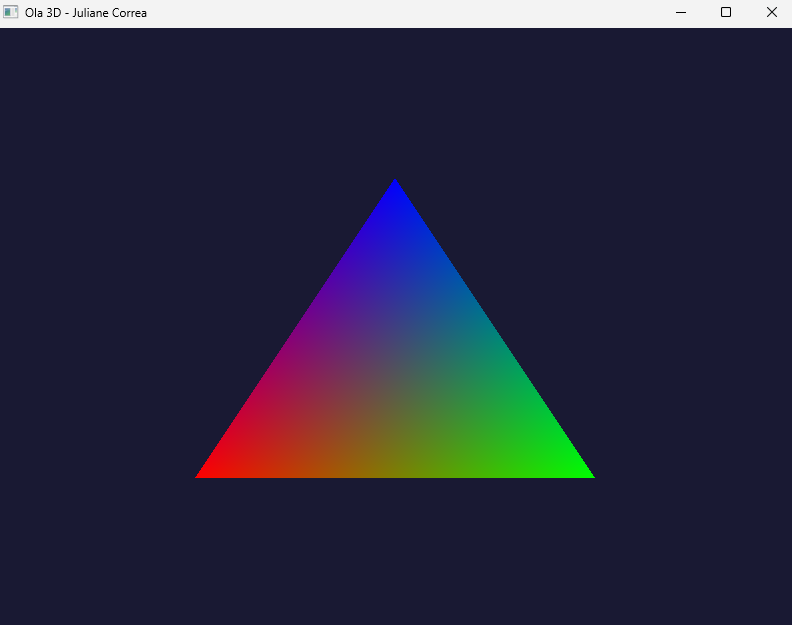
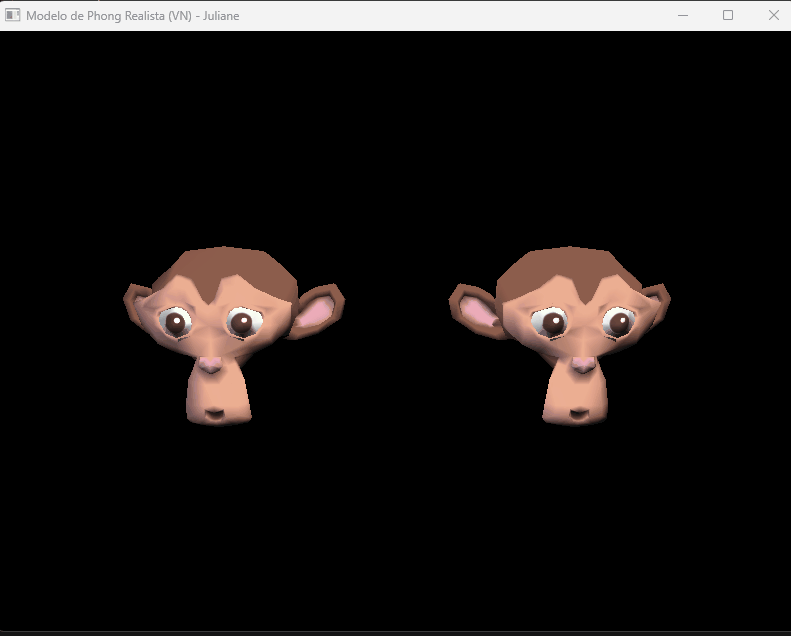
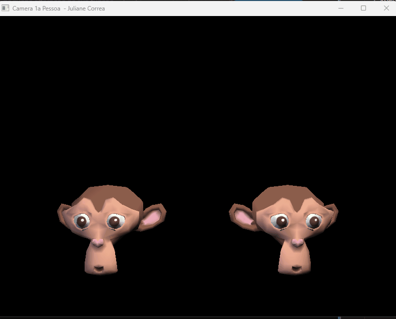

## 1ª Parte - Ambiente

Ambiente configurado com sucesso utilizando Python 3 e OpenGL 2.1 (via PyOpenGL e GLFW).

### Demonstração da Execução do Programa

## 2ª Parte - Cubo e Transformações Geométricas
Implementação da geometria do cubo com cores distintas por face. 

### Controles implementados:
* `W`, `A`, `S`, `D` e `I`, `J`: Translação nos eixos X, Y e Z.
* `X`, `Y`, `Z`: Rotação nos respectivos eixos.
* `[` e `]`: Escala uniforme.
* `TAB`: Alterna a seleção entre os cubos da cena.

### Demonstração da Interação:

## 3ª Parte - Visualizador OBJ e Transformações 3D por Eixo

Implementação do carregamento automatizado do modelo 3D da *Suzanne* (Blender) com controle independente de eixos.

**Controles Implementados:**
* **TAB:** Alterna a seleção entre as duas cabeças da macaca.
* **T (Translação):** Move nos eixos X (A/D), Y (W/S) e Z (Q/E).
* **R (Rotação):** Gira nos eixos X (W/S), Y (A/D) e Z (Q/E).
* **S (Escala):** Escala individual nos eixos X (A/D), Y (W/S) e Z (Q/E).
* **Teclas + e -:** Aplica escala **uniforme** em todos os eixos ao mesmo tempo.

### Demonstração da Interação 

## 4ª Parte - Mapeamento de Texturas (Coordenadas UV)

Nesta etapa, o visualizador foi evoluído para suportar a aplicação de texturas 2D sobre as malhas tridimensionais, realizando a leitura completa dos dados de mapeamento do modelo.

**Implementações Realizadas:**
* **Leitura de Coordenadas UV:** Adaptação do leitor no `objeto.py` para processar as linhas iniciadas com `vt` e associar os índices de textura correspondentes a cada face (`f v/vt/vn`).
* **Integração com arquivo .MTL:** Leitura automatizada do arquivo de material para identificar o arquivo de imagem difusa (`map_Kd`).
* **Carregamento via Pillow (PIL):** Uso da biblioteca Pillow no `main.py` para carregar a imagem do disco, inverter o eixo Y (adequando o padrão de leitura do OpenGL) e enviar os bytes de pixels para a GPU.
* **Configuração de Textura no OpenGL:** Geração de textura com `glGenTextures`, vinculação com `glBindTexture` e definição de filtros lineares de magnificação/minificação para evitar distorções.

### Demonstração das Malhas Texturizadas 

## 5ª Parte - Iluminação de Três Pontos Dinâmica

Nesta última etapa, foi implementado o clássico sistema de iluminação cinematográfica/fotográfica de três pontos, calculado de maneira 100% automatizada com base na posição do objeto selecionado.

**Implementações Realizadas:**
* **Luz Principal (Key Light - GL_LIGHT0):** Fonte de luz mais intensa posicionada à frente e à direita do objeto de foco, definindo o tom e as sombras principais da cena.
* **Luz de Preenchimento (Fill Light - GL_LIGHT1):** Posicionada no lado oposto (à esquerda) com intensidade moderada e tom levemente frio (azulada) para suavizar as sombras geradas pela luz principal.
* **Luz de Fundo (Back Light - GL_LIGHT2):** Posicionada atrás e acima da malha, criando um efeito de silhueta (*rim light*) que separa o objeto tridimensional do fundo escuro da cena.
* **Fator de Atenuação Difusa:** Configuração de atenuação linear nas três fontes de luz (`GL_LINEAR_ATTENUATION`), simulando a perda física de intensidade de luz com base na distância geométrica até a malha.
* **Controle de Teclado Independente:** Mapeamento das teclas numéricas `1`, `2` e `3` para ligar e desligar de forma independente cada uma das três fontes de luz em tempo de execução, permitindo testar o impacto isolado de cada componente.

### Demonstração do Funcionamento

# 6ª Parte - Iluminação Dinâmica (Modelo de Phong)

Implementação do modelo de iluminação de Phong calculando as componentes Ambiente, Difusa e Especular com base nas normais dos vértices (`vn`) extraídas do arquivo OBJ e coeficientes lidos do arquivo de materiais (`.mtl`).

**Controles Implementados:**
* **Controle das Luzes:** Teclas `1`, `2` e `3` alternam o estado (ligado/desligado) das luzes Principal, Preenchimento e Fundo.
* **Interação com o Objeto:** Seleção via `TAB` com manipulação ativa de Translação (`T`), Rotação (`R`) e Escala (`S`) pelos eixos convencionais.

## Demonstração da Iluminação

# 7ª Parte - Câmera em Primeira Pessoa (FPS)

Implementação de uma câmera sintética interativa em primeira pessoa estruturada através de uma classe encapsulada `Camera`. O sistema realiza o cálculo dinâmico de vetores direcionais (`front`, `right`, `up`) a partir de ângulos de Euler para navegar livremente pelo cenário tridimensional.

**Controles Implementados:**
* **Navegação Espacial:** Teclas `W` e `S` realizam a movimentação para frente/trás, enquanto `A` e `D` efetuam o deslocamento lateral (*strafing*).
* **Orientação do Olhar:** As setas direcionais do teclado ($\leftarrow$, $\rightarrow$, $\uparrow$, $\downarrow$) controlam a rotação de *Yaw* e *Pitch* da câmera em tempo real de forma contínua.

## Demonstração da Câmera

